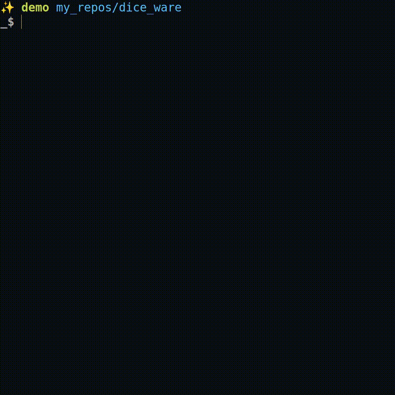

# diceware

Generate secure passphrases by rolling dice on the terminal, using the [EFF](https://www.eff.org/)'s [word list.](https://www.eff.org/files/2016/07/18/eff_large_wordlist.txt).

## Demo



## Inspiration for the project

Inspiration for this project came from hearing about diceware, which is a way to generate
\
secure passphrases by rolling dice.
\
\
The concept materialized for me when I used [this website—d20key](https://d20key.com/#/), created
\
by [Carey Parker—of Firewalls Don't Stop Dragons fame](https://firewallsdontstopdragons.com/podcast/)—et al, to get familiar with dice  ware in general.
\
\
Matter of fact, this project tries to mimic—as closely as possible—the d20key site's functionality,
\
albeit using 5-sided dice.
\
\
In my day-to-day, I do use a password manager to create these passphrases for me,
\
but the diceware method is a good way to get passphrases if one does not have a password manager.

## How to run the program

### 1. Clone this repository and cd into it

Run

```sh
git clone https://github.com/josfam/diceware.git && cd diceware
```

### 2. Create a python virtual environment and install the project dependencies

```sh
python3 -m venv venv-diceware \
&& source venv-diceware/bin/activate \
&& pip install -r requirements.txt
```

### 3. Run the program

> #### On linux/Mac (or WSL for Windows)

```sh
python3 app.py
```

> #### On Windows

```sh
python app.py
```
